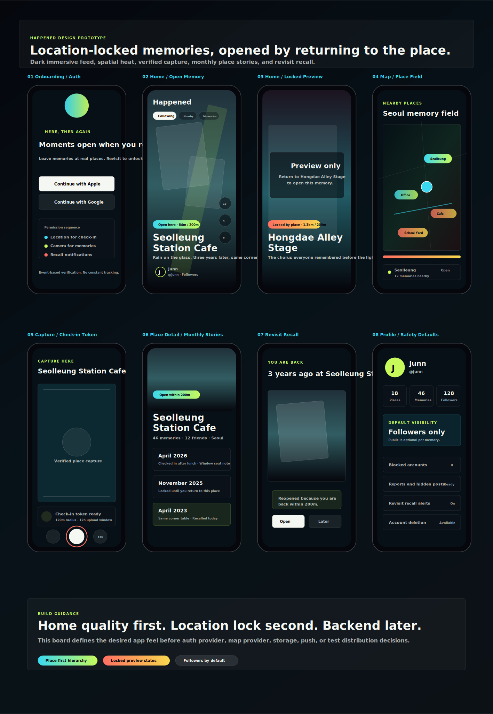

# Report #1: Happened MVP 기획서와 디자인 프로토타입

보고일: 2026-04-24

## 요약

Happened는 장소에 남긴 순간이 그 장소에 다시 도착했을 때 완전히 열리는 위치 잠금형 추억 앱이다. 첫 화면은 지도가 아니라 풀스크린 세로 피드이며, 모든 콘텐츠는 장소명, 거리, 잠금 상태, 공개 범위가 먼저 읽히도록 설계한다.

이번 보고에서는 MVP 기획서, 제품 규칙, 주요 앱 화면 디자인 보드, 보고 채널 방식을 정리했다.

## MVP 기획서

원본 문서:

- [MVP 기획서](../../docs/product-brief.md)
- [제품 규칙](../../docs/product-rules.md)

핵심 제품 약속:

- 여기서 추억을 남긴다.
- 다시 여기 오면 열린다.
- 친구들이 남긴 장소의 이야기를 실제로 방문하며 경험한다.

V1 핵심 기능:

- 이메일/Google/Apple 로그인
- 위치/카메라/사진/알림 권한 온보딩
- 현재 위치 기반 장소 선택
- 12시간 유효한 체크인 토큰
- 사진/영상 업로드
- Following, Nearby, Memories 피드
- 장소 근처에서만 완전 열람
- 반경 밖 블러 프리뷰
- 장소 상세와 월별 타임라인
- 히트맵 스타일 지도
- 재방문 회상 카드/알림
- 신고, 차단, 숨김, 계정 삭제

위치 규칙:

- 업로드 가능: 선택 장소 120m 이내, 위치 정확도 50m 이하
- 나중 업로드: 체크인 성공 후 12시간
- 완전 열람 해제: 장소 200m 이내
- 대형 장소: 최대 300m까지 확장 가능

## 디자인 프로토타입

원본 문서:

- [디자인 프로토타입 설명](../../docs/design-prototype.md)
- [주요 앱 화면 디자인 보드](assets/happened-major-screens.svg)



포함 화면:

- Onboarding/Auth
- Home/Open Memory
- Home/Locked Preview
- Map
- Capture/Check-in Token
- Place Detail
- Revisit Recall
- Profile/Safety

디자인 방향:

- 차콜 네이비 기반의 어두운 화면
- 시안, 라임, 코랄, 옐로, 레드 포인트
- 짧은 영상 앱 같은 홈 몰입감
- 지도 앱보다 미디어 앱에 가까운 공간감
- 장소 정보가 소셜 지표보다 먼저 보이는 위계
- 잠긴 콘텐츠는 맥락만 보여주고 현장 방문 동기를 만든다

## GitHub 보고 방식

보고서는 `reports/YYMMDD-번호-주제/` 형식으로 누적한다.

이번 보고:

```text
reports/260424-001-project-brief/
  report.md
  assets/
    happened-major-screens.svg
```

이미지는 GitHub에서 바로 볼 수 있게 SVG를 포함했다. 현재 디자인 보드는 약 18KB라 GitHub 저장에 전혀 부담이 없다.

## 다음 작업

다음 보고는 `Report #2: 홈 UI 프로토타입`으로 남긴다. 디자인 보드 기준으로 실제 앱 홈 화면의 장소명, 거리, 잠금 상태, 블러 프리뷰, 피드 전환을 더 정교하게 맞춘다.
