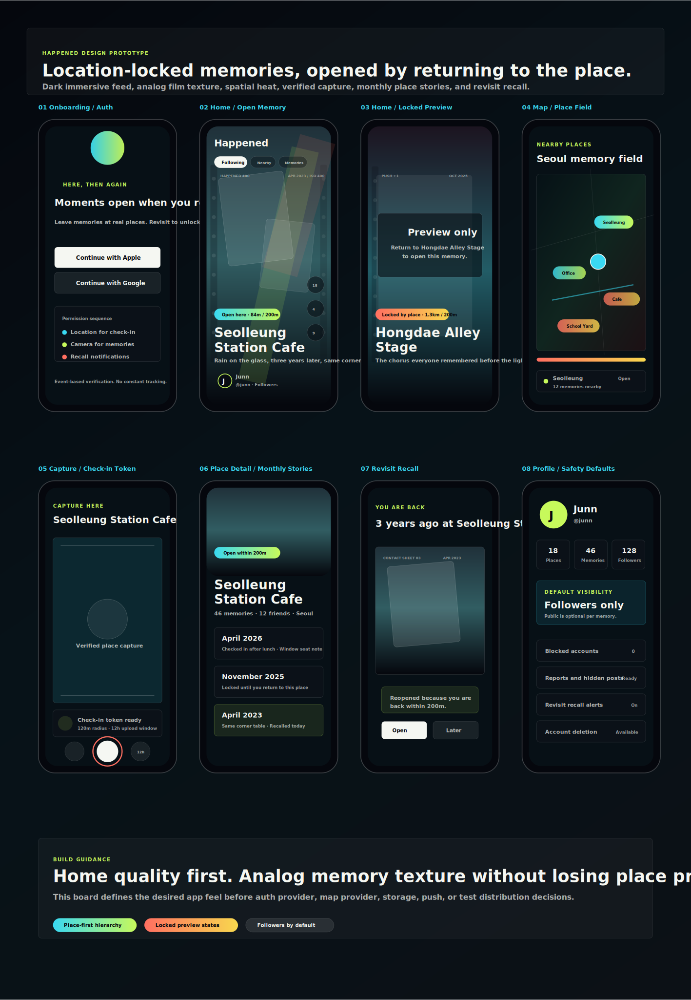

# Report #2: 아날로그 필름 감성 반영

보고일: 2026-04-24

## 받은 피드백

앱이 약간 아날로그처럼 느껴졌으면 좋겠다. 필름 같은 요소가 들어가면 좋겠다.

## 반영 방향

기존의 차콜 네이비 기반, 장소 우선 정보 구조는 유지했다. 여기에 기억이 "필름으로 남아 있다가 장소에서 다시 현상되는" 느낌을 추가했다.

추가한 디자인 요소:

- 필름 프레임 양쪽 perforation 느낌
- `HAPPENED 400`, `ISO 400`, `35MM`, `PUSH +1` 같은 필름 롤 스탬프
- 날짜/장소 기반 타임스탬프
- 코랄 라이트 리크
- 컨택트시트 같은 회상 화면 리듬
- 더 거친 아날로그 기억 질감

## 업데이트된 디자인 보드

파일:

- [업데이트 디자인 보드](assets/happened-major-screens-analog-film.svg)
- [원본 디자인 문서](../../docs/design-prototype.md)

## 앱 코드 반영

홈 피드 프로토타입에도 같은 방향을 반영했다.

변경 내용:

- 피드 미디어 위에 필름 프레임 오버레이 추가
- 좌우 필름 구멍 형태 추가
- 상단/하단 필름 스탬프 추가
- 게시물별 `filmStamp` 데이터 추가
- 코랄 라이트 리크 추가

관련 파일:

- `src/screens/HomeScreen.tsx`
- `src/data/happened.ts`
- `src/types/happened.ts`
- `src/theme/tokens.ts`

## 판단

이 방향은 Happened의 핵심인 "장소에 남은 기억"과 잘 맞는다. 다만 필름 장식이 장소명/거리/잠금 상태를 밀어내면 안 되므로, 장식은 낮은 opacity로 두고 정보 위계는 기존처럼 장소 우선으로 유지한다.

## 다음 작업

이제 실제 앱 화면에서 홈 피드 완성도를 더 끌어올린다. 다음 보고는 `Report #3: 홈 UI 프로토타입 개선`으로 남긴다.
