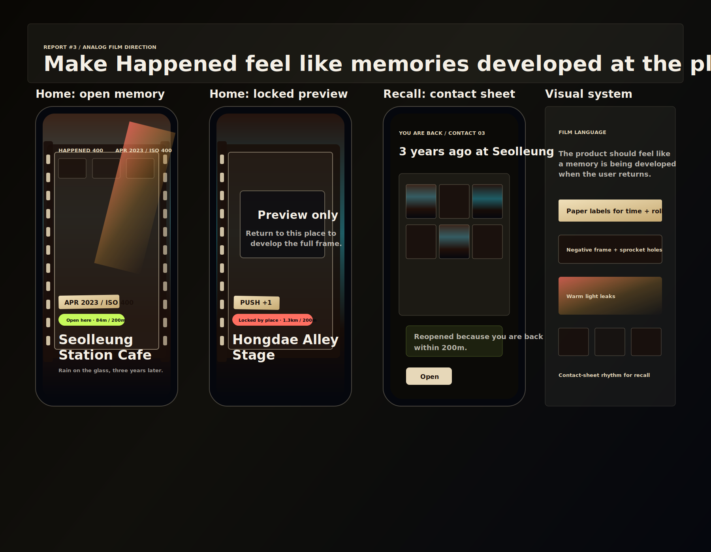

# Report #3: 아날로그 필름 무드 재작업

보고일: 2026-04-24

## 피드백

이전 버전은 필름 감성이 잘 보이지 않았다. 차이가 약했고, 단순한 얇은 오버레이처럼 보였다.

## 수정 판단

맞는 피드백이다. 이전 반영은 필름 구멍과 작은 스탬프만 얹은 수준이라 제품 무드로 읽히기 어려웠다. 이번에는 장식이 아니라 화면 구조 자체를 아날로그 필름 쪽으로 바꿨다.

## 새 방향

Happened의 기억은 "장소에 다시 도착했을 때 현상되는 필름"처럼 보이게 한다.

강화한 요소:

- 네거티브 필름 프레임
- 좌우 sprocket hole
- 따뜻한 종이 라벨
- `ISO 400`, `PUSH +1`, 날짜 번인 스탬프
- 코랄/앰버 라이트 리크
- 회상 화면의 컨택트시트 리듬
- 차가운 디지털 지도 앱보다 따뜻한 필름 다이어리 톤

## 새 디자인 보드

원본:

- [아날로그 필름 방향성 보드](../../docs/prototypes/happened-analog-film-direction.svg)

## 앱 코드 반영

홈 피드에 실제로 반영한 것:

- 배경에 따뜻한 필름 톤 레이어 추가
- 미디어 영역에 종이 매트 프레임 추가
- 좌우 네거티브 필름 프레임과 sprocket hole 강화
- 상단 컨택트시트 썸네일 추가
- 게시물별 필름 라벨을 장소명 위에 배치
- 잠금 문구를 "open"보다 "develop the full frame" 쪽으로 변경

관련 파일:

- `src/screens/HomeScreen.tsx`
- `src/theme/tokens.ts`
- `docs/prototypes/happened-analog-film-direction.svg`

## 유지한 원칙

아날로그 감성을 강하게 넣되, 장소명/거리/잠금 상태가 먼저 읽히는 원칙은 유지했다. 필름 장식이 장소성을 밀어내면 Happened의 차별점이 흐려지므로, 정보 위계는 그대로 둔다.
