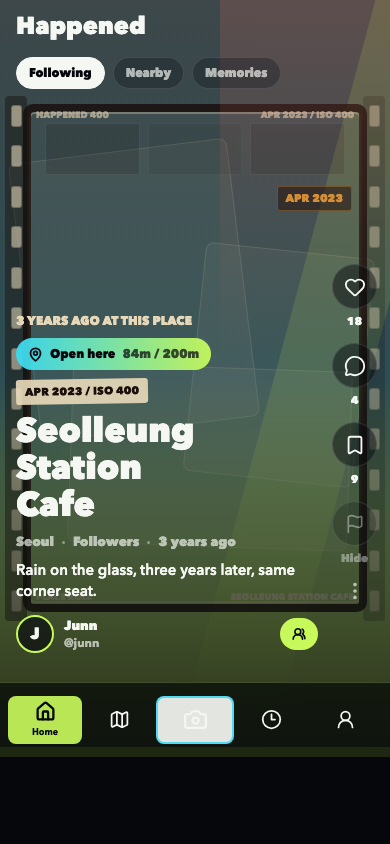
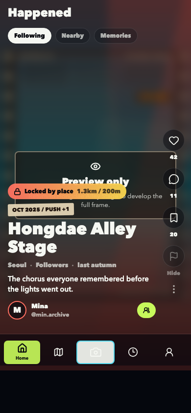
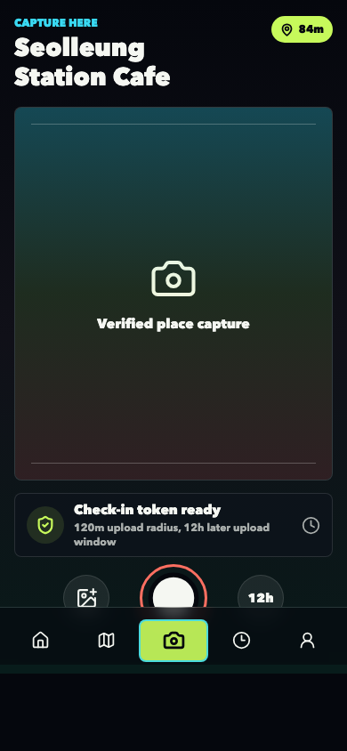
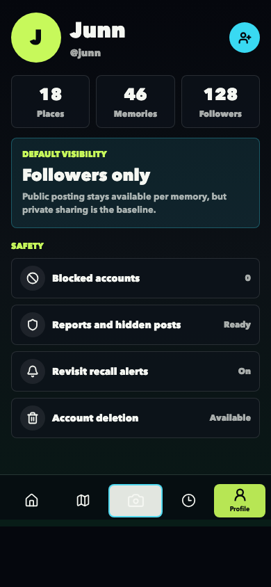

# Report #4: 실제 앱 렌더 스크린샷

보고일: 2026-04-24

## 요청

기존 이미지는 컨셉 보드처럼 보인다. 실제 구현된 앱처럼 완성도 있는 프로토타입 이미지를 보고 싶다.

## 처리 방향

SVG 컨셉 보드 대신 실제 Expo 앱을 웹으로 렌더링하고, headless Chrome으로 모바일 크기 스크린샷을 캡처했다. 이제 보고용 이미지는 "그림으로 설명한 화면"이 아니라 현재 앱 코드가 실제로 렌더링한 화면이다.

추가한 것:

- `capture:prototype` 스크립트
- 캡처용 URL 파라미터: `?capture=1&screen=home`
- 홈 피드의 특정 포스트 캡처: `homePost=0`, `homePost=1`
- 390x844 모바일 프레임 고정
- Home, Map, Capture, Timeline, Profile 스크린샷 자동 생성

## 실제 앱 스크린샷

### Home / Open Memory

### Home / Locked Preview

### Map

### Capture

### Timeline

### Profile

## 산출물

이미지 파일:

- `assets/home-open.png`
- `assets/home-locked.png`
- `assets/map.png`
- `assets/capture.png`
- `assets/timeline.png`
- `assets/profile.png`

관련 코드:

- `scripts/capture-prototype.mjs`
- `App.tsx`
- `src/screens/HomeScreen.tsx`
- `src/components/BottomTabs.tsx`

## 현재 판단

이 방식이 앞으로 보고용으로 더 적합하다. 디자인 방향을 설명할 때는 SVG 보드를 쓰고, 실제 구현 완성도를 확인할 때는 PNG 스크린샷을 쓴다.

다음부터 화면 작업 보고는 가능하면 이 방식으로 실제 앱 렌더 이미지를 함께 첨부한다.
