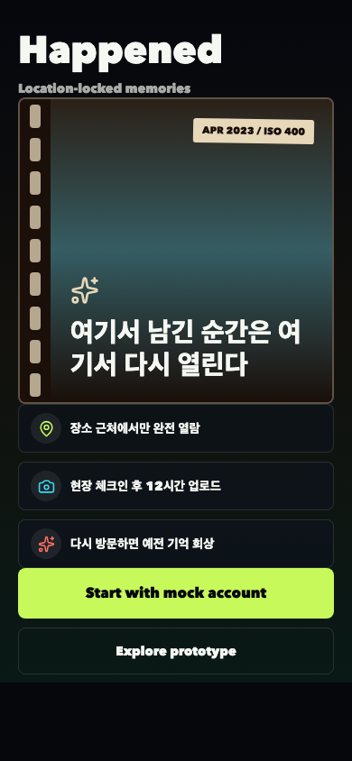
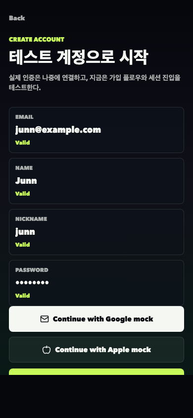
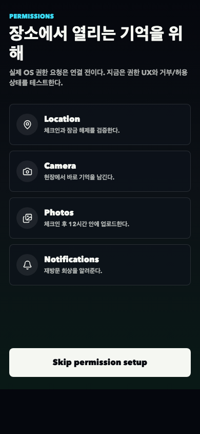
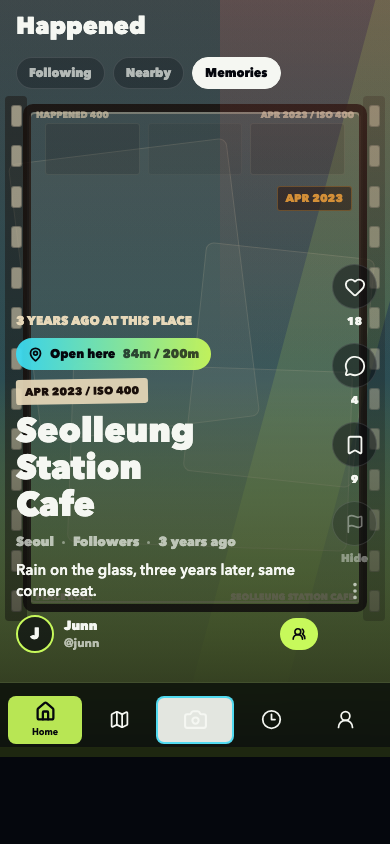
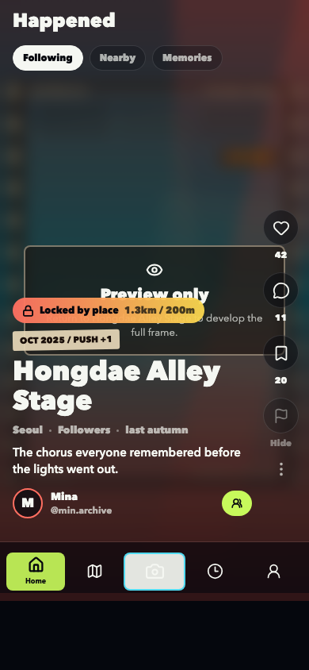
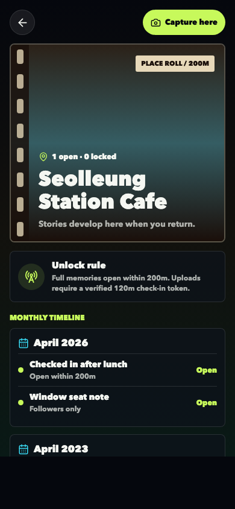
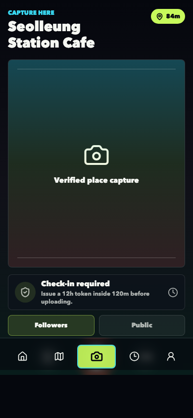
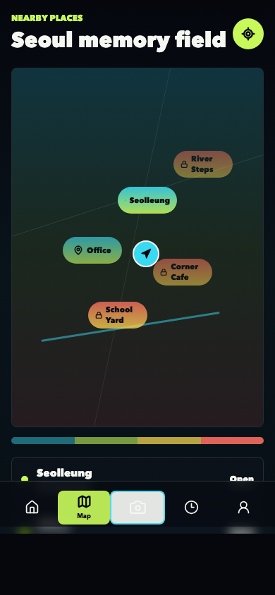
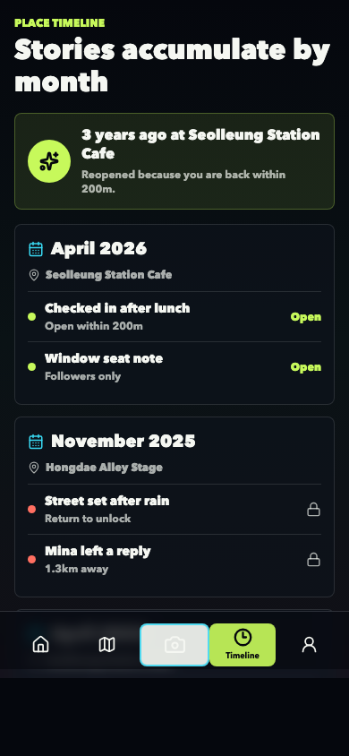
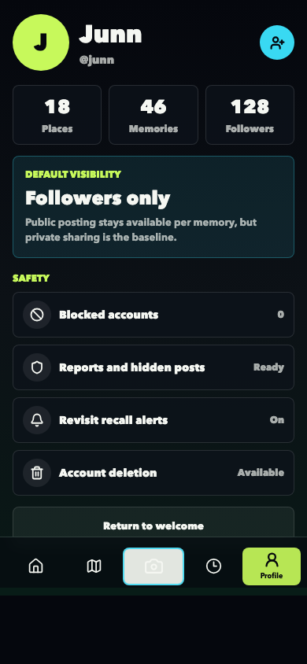

# Report #5: 테스트 가능한 앱 플로우

날짜: 2026-04-24

## 이번 결과

더미 데이터만으로 앱 안에서 주요 흐름을 눌러볼 수 있게 연결했다. 아직 백엔드/인프라/배포 결정은 하지 않았다.

- 온보딩 → mock 인증 → 권한 UX → 메인 앱 진입
- Home 피드의 Following/Nearby/Memories 전환
- 피드/지도/타임라인에서 장소 상세 진입
- 장소 상세에서 Capture here 진입
- Capture 화면에서 체크인 토큰 발급과 mock 업로드 상태 변경
- Profile의 안전/신고/차단/계정삭제 진입점 mock 동작

## 현재 테스트 방법

```bash
npm run dev
```

Mac mini의 포트 충돌을 피하기 위해 dev 스크립트가 `8097`부터 사용 가능한 포트를 자동 선택한다.

## 검증

```bash
npm run typecheck
npm run capture:prototype
```

결과: TypeScript 타입체크 통과, Expo Web 렌더 기반 스크린샷 생성 완료.

## 스크린샷

### Welcome



### Mock Auth



### Permissions



### Home Open



### Home Locked



### Place Detail



### Capture



### Map



### Timeline



### Profile



## 다음 개발 방향

바로 이어서 실제 앱 테스트 밀도를 높인다. 우선 더미 상태를 더 정교하게 만들고, 체크인/업로드/장소 선택/잠금 해제 규칙을 앱 내부 로직으로 분리한 뒤 실제 권한 요청과 카메라/위치 API 연결 준비로 넘어간다.
